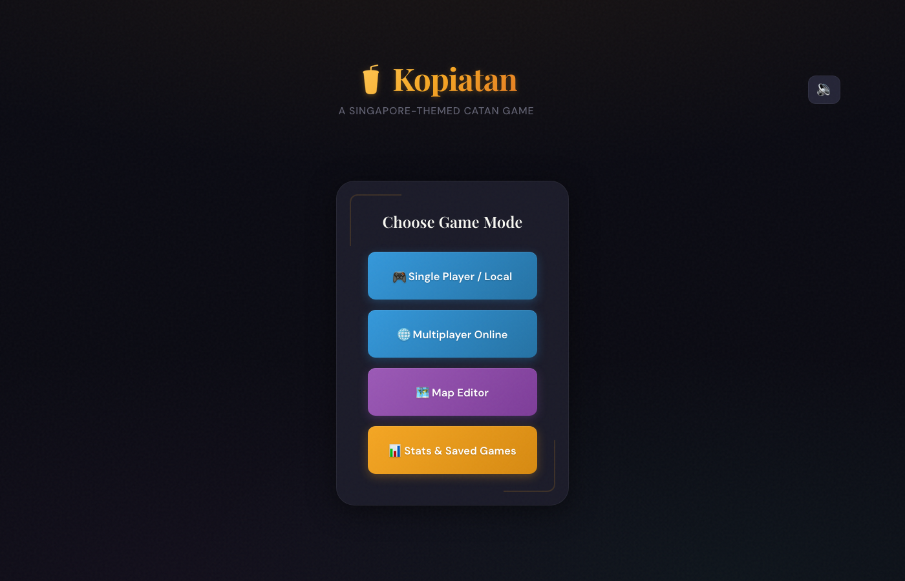
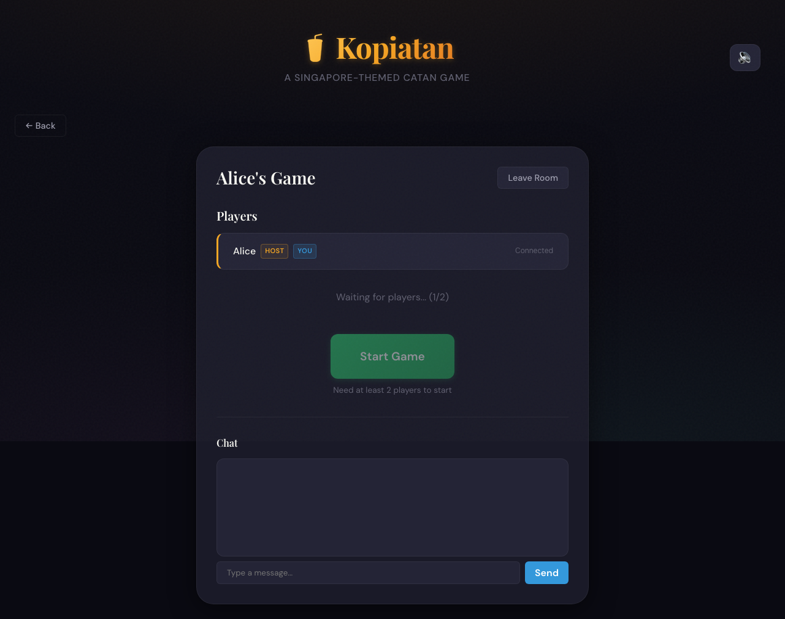
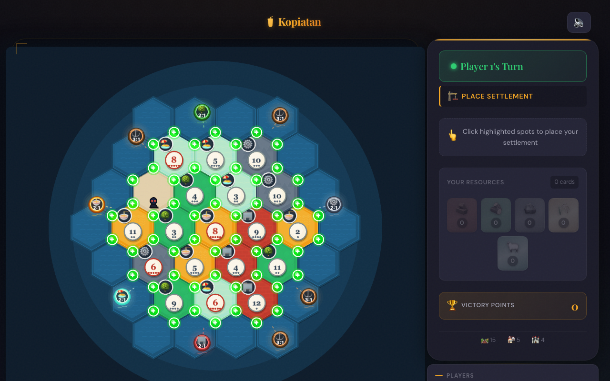
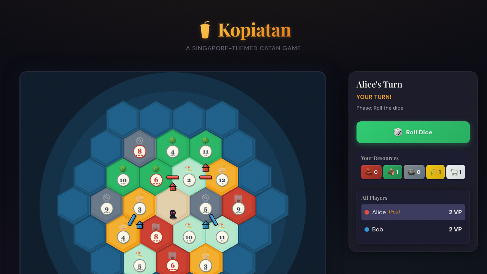
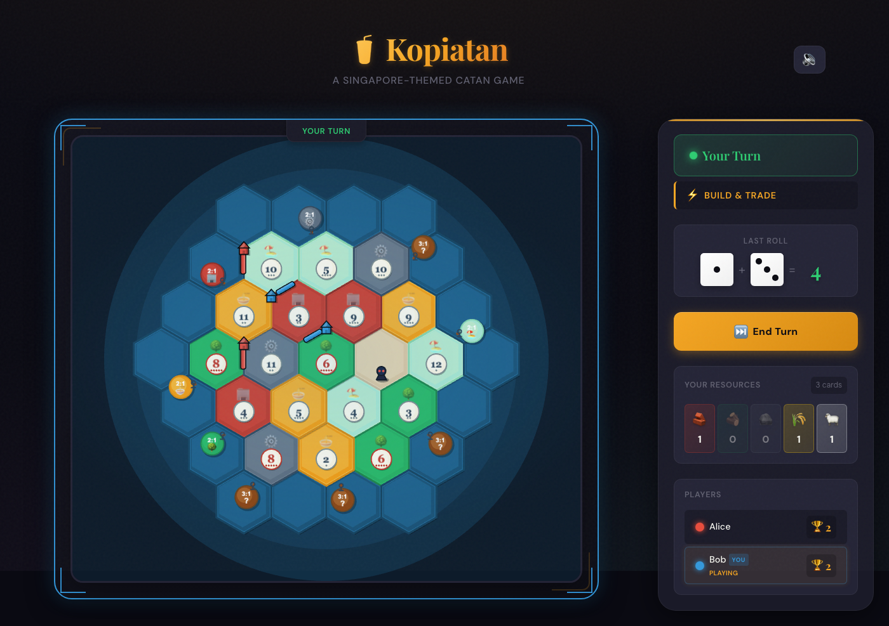

# Kopiatan

A Singapore-themed Catan game built in Rust with WebAssembly support and real-time multiplayer.

## Screenshots

### Main Menu


### Multiplayer Lobby


### Game Board - Setup Phase


### Game Board - Complete Setup


### Dice Roll & Main Phase


## Features

- **Full Catan Gameplay**: Complete implementation of Catan rules
- **Singapore Theme**: Resources themed after Singapore landmarks
- **Multiplayer**: Real-time WebSocket multiplayer with room system
- **Single Player**: Play locally with multiple players
- **Map Editor**: Create custom board layouts
- **Save/Load**: Persist game state
- **AI Bots**: Play against computer opponents
- **Polished UI**: Enhanced visuals with 3D-effect tiles, animated highlights, and placement feedback

## Project Structure

```
kopiatan/
├── crates/
│   ├── catan-core/     # Core game engine (Rust)
│   └── catan-server/   # WebSocket game server
├── frontend/           # SolidJS + Pixi.js UI
└── screenshots/        # E2E testing screenshots
```

## Quick Start

### Prerequisites
- Rust (latest stable)
- Node.js 18+
- pnpm

### Running the Game

1. **Start the game server:**
```bash
cd crates/catan-server
cargo run
```

2. **Start the frontend:**
```bash
cd frontend
pnpm install
pnpm dev
```

3. Open http://localhost:5174 in your browser

### Running Tests

```bash
cargo test
```

## Game Phases

The game follows standard Catan phases:
1. **Setup**: Place initial settlements and roads
2. **PreRoll**: Roll dice to start turn
3. **MainPhase**: Build, trade, and develop
4. **RobberMoveRequired**: Move robber when 7 is rolled
5. **DiscardRequired**: Discard cards when you have 8+ and 7 is rolled

## Singapore Theme

Resources are themed after Singapore landmarks:
- **Brick** → HDB Estates (construction)
- **Lumber** → Botanic Gardens (nature reserves)
- **Ore** → Jurong Industrial (heavy industry)
- **Grain** → Hawker Centers (food culture)
- **Wool** → Sentosa (leisure/tourism)
- **Desert** → Bukit Timah (nature reserve)

## Development Roadmap

- [x] Phase 1: Core Game Engine
- [x] Phase 2: Local Single-Player UI (WASM + SolidJS)
- [x] Phase 3: Multiplayer Infrastructure (WebSocket)
- [x] Phase 4: Custom Map Editor
- [x] Phase 5: Trading & Robber Polish
- [x] Phase 6: Bot Players
- [x] Phase 7: Persistence & Accounts
- [x] Phase 8: Deployment

## License

MIT
